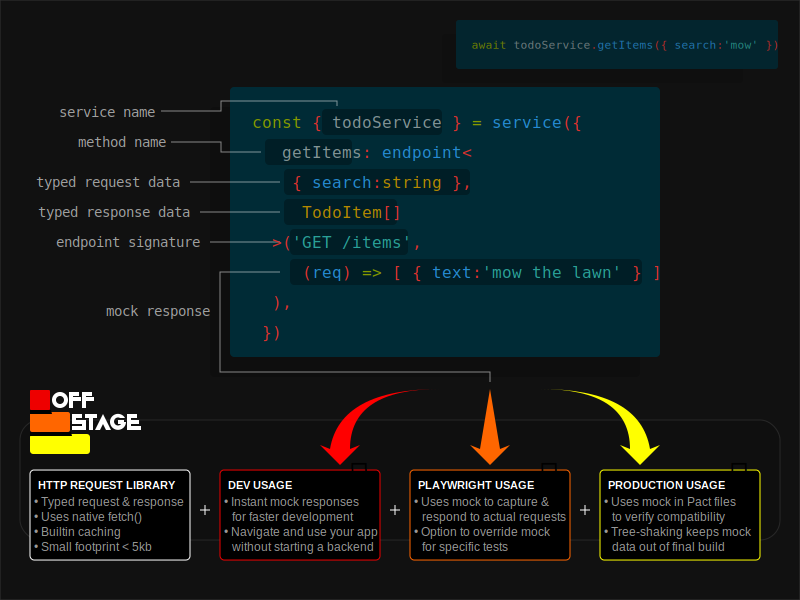

# 
## TypeScript HTTP Client for faster development and testing

Offstage is a HTTP request library, with a focus on **mocking** and **testing**.

You define your mock data **once**, Offstage then allows you to:

- Click through your app without a backend
- Playwright test the production build
- Verify backend compatibility by auto generating Pact files


## Infographic!


# Highlights

- 🚀 Easily define a **TypeScript Request API**
- ⚡️ **Mock data** for development (stripped out of production build)
- 🎭 **Same** mock data for Playwright (to test the production build)
- 🦄 **Override** mock data (for testing specific scenarios)
- 🤝 Automatic **Pact** tests (to verify compatability) (experimental)
- 🔥 **Small** footprint (adds less than 5kb to your production build)

# Getting started

## 1. Install
```bash
npm i offstage
```

## 2. Define service
```ts
import { service, endpoint } from 'offstage/core'

export const { exampleService } = service({
  foo: endpoint<
    {id:number}, // typed request
    {message:string} // typed response
  >('GET /foo', // endpoint method and path
  ({ id }) => ({ message: `hello ${id}` }), // mock response for dev & testing
});

```

## 3. Use service
```ts
await exampleService.foo({ id:2 }); // { message:'hello 2' }
```

# Usage with playwright

Your mock data gets stripped out of production build. To still use mock data in your tests, you can use `attach()` from `offtsage/playwright`. It will intercept requests and respond with your mock data.

## 4. intercept requests with attach
```ts
// tests/example.spec.ts
import { test } from '@playwright/test';
import { attach } from 'offstage/playwright';
attach(test); // requests of 'GET /foo' are now intercepted
```

## 5. optionally override responses
```ts
// tests/override.spec.ts
import { test } from '@playwright/test';
import { attach } from 'offstage/playwright';
import { exampleService } from '../src/example-service.ts';
attach(test);

test('testing with an override', async({page}) => {
  exampleService.foo.override((requestData,responseData) => {
    return { ...responseData, message: 'override works!' };
  });
  // requests of 'GET /foo' are now responded with { message:'override works! }
});
```
# Configuration

You can use `configure(configurators:[])` to configure things like `baseURL`, `headers`, `credentials` etc.

The configurators are called in turn with details of the current request. The results are then combined to form a final configuration.


**6. Configuration**
```ts
import { configure } from 'offstage/core';

configure([
  // every request gets the same baseURL by default:
  () => ({ baseURL: process.env.VITE_API_URL }),

  // every request gets the same token:
  () => ({ headers: { Authorization: `Bearer {token}` } }),

  // exampleService.hello gets a different baseURL:
  ({ serviceMethodName }) => serviceMethodName === 'exampleService.hello'
    ? { baseURL: process.env.VITE_EXAMPLE_API_URL }
    : {}
]);
```

Offstage uses `fetch()` behind the scenes so you can refer to https://developer.mozilla.org/en-US/docs/Web/API/fetch for most of the options. 

# Documentation
[Read the Documentation](https://livinglogic-nl.github.io/offstage/)
